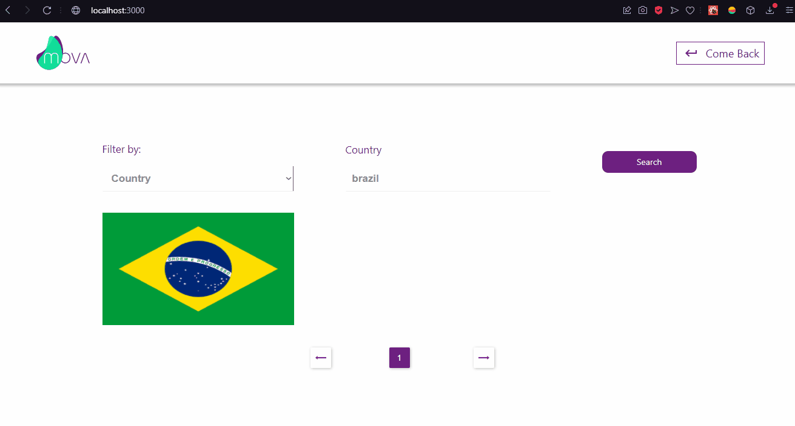

<h1>Países e seus dados</h1>

<h2>Sobre</h2>

<p>Aplicação que filtra países de acordo com sua região, capital, idiomas ou capital, <br/>
    e mostra seus respectivos dados (nome, capital, população, idiomas, região e subregião)
</p>

### Features
- [x] Área de filtragem
- [x] Área para visualizar os dados
- [X] Rotas
- [X] Paginação
- [X] Totalmente responsivo

<h1>
    
</h1>
<h1>
    
</h1>
<h1>
    
</h1>


### Pré-requisitos
Antes de começar, você vai precisar das seguintes ferramentas: [Git](https://git-scm.com), [Node.js](https://nodejs.org/en/) e um editor de código, como o [VSCode](https://code.visualstudio.com/)

### Rodando o projeto
```bash
# Clone este repositório
git clone https://github.com/MalcolmMello/CountriesAPI
# Acesse a pasta do projeto pelo seu terminal
cd CountriesAPI

# Instale as dependências
npm install

# Inicie a aplicação
npm start

# O servidor irá rodar na porta:3000 - acesse <http://localhost:3000>

```

### Tecnologias
- React
- Styled-components
- Router
- Hooks
- API

---

Feito por mim - Veja mais detalhadamente no [Meu LinkedIn](https://www.linkedin.com/in/malcolm-de-mello-a8208a224/)